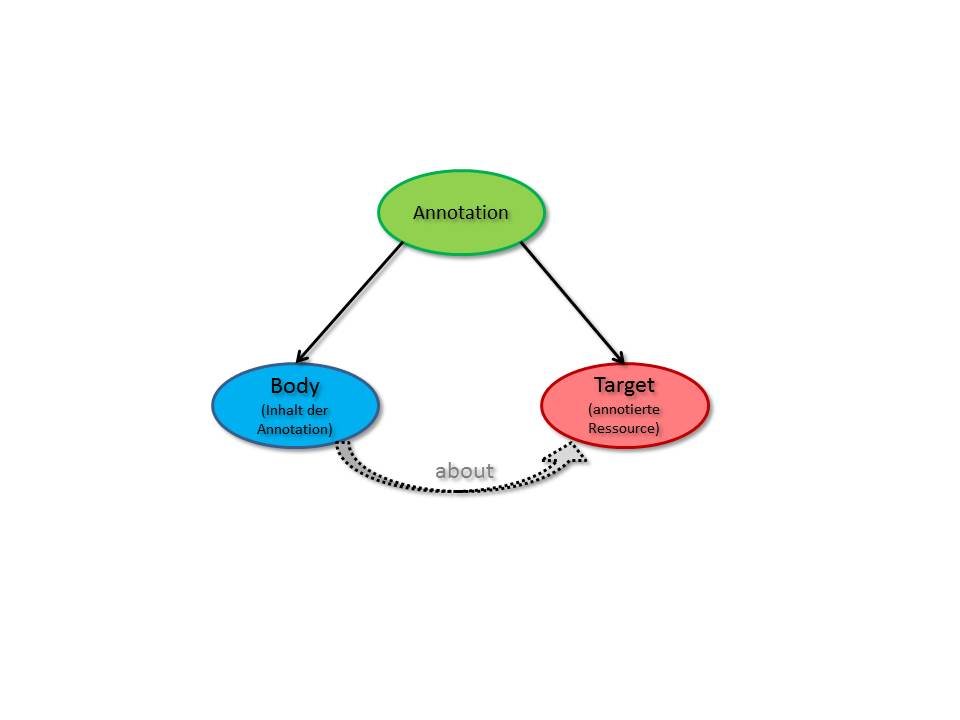

# Open Annotation

## Was ist Annotation?

Man benutzt Annotation fast jeden Tag. Jeder Mensch hat schon selbst viele Annotationen getätigt.Ob es nun eine Notiz am Rande eines Buches ist, eine Anmerkung in einer PDF Datei oder ein Verbesserungsvorschlag in den online Kommentaren oder auf dem Papier – all das ist nichts anderes als eine Annotation. 
Eine Annotation bedeutet  Anmerkung, Beifügung, Hinzufügung. In diesem Sinn haben Annotationen den Charakter der Erklärung bzw. Ergänzung. 
Annotationen halten wichtige Zusatzinformationen fest. Diese Informationen sind zwar keine wesentlichen Stichworte und kein Haupttext, aber sie haben für den der sie verfasst hat eine  Bedeutung.
Annotation drückt quasi die Beziehungen zwischen zwei oder mehreren Ressourcen aus. Also es besteht eine gewisse Verbindung. 

## Die Entwicklung der Annotation

Heutzutage wird es  nicht nur auf Papier annotiert. 
Im Internet gibt es viele Möglichkeiten, verschiedene Texte und sämtliche Webseiten oder auch Multimedia-Dateien zu annotieren. 
Genauer gesagt, es kann alles, was im Internet eine Äquivalenz hat, zum Beispiel auch Personen, deren Profile bei Facebook, annotiert werden können.
„Digitale Annotationen sind digitale Objekte, die an andere digitale Objekte „angehängt“ sind.“ 
Am Anfang wurden die papierbasierte Annotationsformen für die digitale Welt angepasst. 
Alle Dokumente  wurden mit Metainformationen versehen, die die Indexierung und Abfrage von Inhalten ermöglicht haben. 
Zunächst wurde diese Form der Annotierung nur auf Texte angewendet, danach auch auf andere digitale Objekte wie eine Webseite, ein Bild oder ein Video. 
Annotationen können dabei sowohl ergänzende Informationen zu einem Dokument beinhalten, aber auch in kollaborativen Prozessen eingesetzt werden – das bedeutet das die Ideen und Meinungen zu gemeinsamen Dokumenten können ausgetauscht werden beziehungsweise mit anderen „geteilt“ werden. 
Problematisch bei digitalen offenen Annotationen sind verschiedene Systemen und verschiedene Tools, die die Nutzer verwenden. Im Mai 2012 entwickelte die Open Annotation Community Group7 (W3C) eine Reihe von Vorarbeiten um die Annotationen zu spezifizieren und erstellte mit dem Open Annotation Core Data Model ein Referenzmodell für die Annotation von Ressourcen (auch Webressourcen). Das Grundprinzip sieht folgendermaßen aus: Eine Annotation wird prinzipiell als eine Verbindung zwischen der annotierten Ressource („target“) und dem Inhalt der Annotation („body“) definiert (siehe Abb.1).

Die Verbindung bedeutet, dass der Inhalt der Annotation irgendwie mit der annotierten Ressource zu tun hat.
Das primäre Ziel der Open Annotation Datenmodell ist der Mechanismus für den Austausch von Anmerkungen zwischen den Systemen. Dieser Mechanismus mit der Fähigkeit der Zusammenarbeit von verschiedenen Systemen kann entweder für den Austausch mit anderen oder die Migration von privaten Anmerkungen zwische den Geräten sein. Die gemeinsamen Anmerkungen (Ergänzungen/Annotationen) eines Dokuments/Datei/Webseite müssen in bestehende Sammlungen integriert beziehungsweise archiviert und wiederverwendet werden, ohne Verlust von wichtigen Informationen. 
Das Modell sollte so viele Annotationsanwendungsfälle wie möglich abdecken.

## Warum Annotationen bei Webressourcen?

Es gibt ganz unterschiedliche Motive, warum man Annotationen zu (Web-) Materialien hinzufügt beziehungsweise sie hinzufügen lässt. 
Im Wesentlichen lassen sich dabei die Absichten der Anbieter der entsprechenden Plattformen von den Nutzern unterscheiden.
Zum Beispiel schauen die Anbieter von Medienarchiven oder Webmaterialien. Diese unterstützen und nutzen Annotationen vor allem um die Recherche der Medien/Materialien zu verbessern, um gute Empfehlungen für passendes weiteres Material zu geben, um die Materialien intelligent und sicher mit externen Daten und Ressourcen zu verknüpfen, um das Ranking bei Suchmaschinen zu verbessern, um das interne Wissensmanagement zu verbessern. 
Aus Sicht des einzelnen Nutzers ist die Annotation wichtig für das eigene Informationsmanagement und um Materialien für andere erschließbar zu machen. Ob und wie einzelne Nutzer,  die Medien/Materialen annotieren, hängt auch von der Art der Nutzung ab, also mit welchem Zweck sie es nutzen.

## Annotationsformen und -kombinationen

Es gibt unterschiedliche Formen der Annotation:

### Professionelle Klassifikation

Um Texte recherchierbar zu machen, werden häufig Volltextsuchen eingesetzt.  Dabei stößt man auf das Problem, dass man verwandte Begriffe oder Konzepte, die im Text vorhandenen sind bei der Annotationen nicht vorkommen, somit sind sie auch nicht recherchierbar.
Mit Hilfe von der Terminologie, also ein kontrolliertes Vokabular, werden Terme in Verbindung gebracht.

### Freie Verschlagwortung und Social Tagging
Im Internet wurde ein Verfahren ins Leben gerufen, das Nutzern ermöglicht, Webseiten oder andere Ressourcen mit eigenen Schlagworten zu markieren, sie zu „taggen“. 
Mit Hilfe der Tags können andere entsprechende Ressourcen recherchiert werden.
Beim Social Tagging sind alle Benutzer beteiligt und es gibt im Grunde kein kontrolliertes Vokabular. 
Die Grenzen dieses Ansatzes werden an der Herausforderung der Mehrsprachigkeit  und/oder an der unterschiedlichen Schreibweise deutlich.

### Automatische Annotation
Neben den von Personen durchgeführten Annotationen gibt es auch automatisch generierte Annotationen. 
Hier wird automatisch aus dem Text oder den Bildern Informationen generiert. Auch werden die zahlreichen (Meta-) Informationen bei der Entwicklung von Annotationen berücksichtigt, zum Beispiel - Wie wird ein Beitrag bewertet, wie häufig wird er aufgerufen, wen interessiert eine Webseite und so weiter.

### Kombination 
Um zu ausreichenden und qualitativ besseren Ergebnissen zu kommen, werden die drei Formen der Generierung von Metadaten oft in einer Kombination eingesetzt: die automatische Generierung von Metadaten mit manuell erzeugten Metadaten durch Tagging oder Klassifikation.

## Ausblick
Bessere einheitliche Modelle, Systemen, Mechanismen, die allen Nutzer, unabhängig vom Wissensniveau, erlauben an allen möglichen Projekten im World Wide Web teilzunehmen. Sichere Archivierungsmöglichkeiten für alle Annotationen der Welt. Das alles wird sich in der nächsten Zeit, schritt für schritt, weiter entwickeln und somit werden alle Nutzer, Wissenschaftler und so weiter verbunden und können gemeinsam an einem Dokument arbeiten - das ist das größte Ziel. 

## Beispiel für Projekte
Die _iAnnotate_ wurde organisiert um die Menschen noch näher zusammen zu bringen – Kommunikation und weltweiter Austausch. 
Im Jahr 2013 wurden die Anwendungsfälle für die Annotation besprochen, geteilt und präsentiert. 
In diesem Jahr, 2014, werden weitere Pläne für das kommende Jahr besprochen und geteilt. Besonderer Wert wird auf Standardisierung gelegt. 
Es wurden neue Projekte vorgestellt, an denen man mitarbeiten kann.

## Beispiel eines Instrument

_Annotator_
Annotator ist eine Open-Source-JavaScript-Bibliothek für die Erstellung einer Annotation im Web. Es stellt eine Reihe von Werkzeugen zur Verfügung, um Text in Webseiten zu kommentieren. Es ist auch einfach zu bedienen.

## Literaturliste

